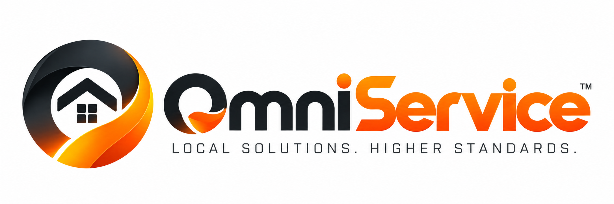
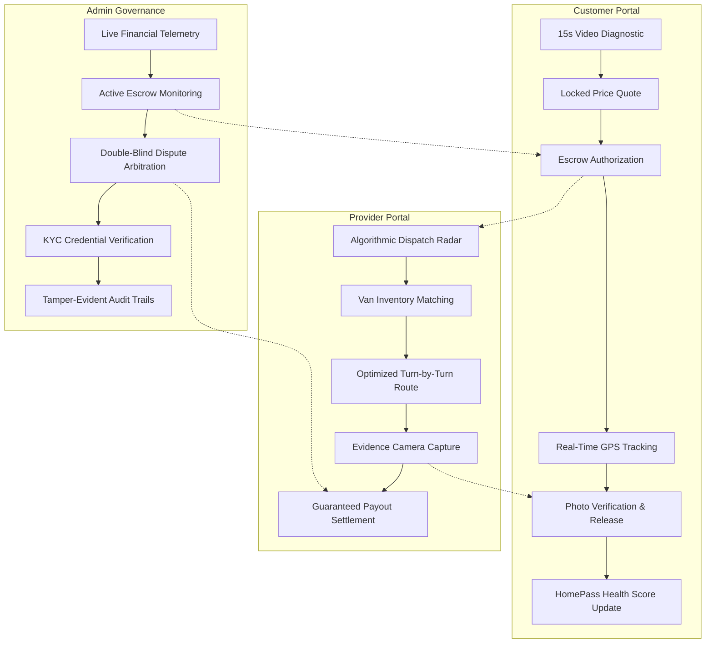

<div align="center">



# OmniService AI
### *&ldquo;Local Solutions. Higher Standards.&rdquo;*

**An AI-Native Autonomous Home Contracting Operating System Engineered for Greater Hyderabad**  
*Built &amp; Operated by [Volcanic Digital Solutions](https://volcanic.world)*

[](https://omniservice.volcanic.world/)
[](https://omniservice.volcanic.world/case-study)
[](https://nextjs.org/)
[](https://www.typescriptlang.org/)
[](https://www.mongodb.com/)
[](https://vitest.dev/)
[](https://omniservice.volcanic.world/)

<br />

[**🚀 Launch Live Web Application**](https://omniservice.volcanic.world/) &nbsp;&bull;&nbsp; [**📑 Interactive Case Study**](https://omniservice.volcanic.world/case-study) &nbsp;&bull;&nbsp; [**📧 Contact Engineering**](mailto:volcanic.digitalsolutions@gmail.com)

---

</div>

## 🌟 Executive Summary: Real Problem & Solution

Urban home services in India face a persistent **"trust and efficiency deficit"**:
1. **Asymmetric Information &amp; Price Gouging**: Homeowners cannot independently verify whether a contractor's diagnosis is genuine or an inflated estimate.
2. **Multiple Trips &amp; Van Stock Deficits**: Over 60% of repair jobs require technicians to leave mid-job to procure spare parts, causing delays and doubling travel overhead.
3. **Adversarial Settlement &amp; Wage Disputes**: Upfront payments leave customers vulnerable to incomplete repairs, while post-pay models leave technicians exposed to payment defaults.

**OmniService AI** eliminates these structural frictions through a continuous, closed-loop algorithmic pipeline:
```
15s Multimodal Video Scan ➔ InspectAI Diagnostic ➔ SmartRoute Van-Inventory Dispatch ➔ TrustLock Fiduciary Escrow ➔ Photographic Workmanship Proof ➔ Immutable HomePass Passport
```

---

## 🔑 Quick-Access Evaluator Credentials

Evaluators and reviewers can immediately explore all three distinct platform roles on the [Live Deployment](https://omniservice.volcanic.world/login):

| Role | Test Email | Password | Primary Portal Route |
| :--- | :--- | :--- | :--- |
| **Governance Admin** | `admin@omniservice.volcanic.world` | `Admin@123` | [`/admin/dashboard`](https://omniservice.volcanic.world/admin/dashboard) |
| **Service Professional (Pro)** | `provider@omniservice.volcanic.world` | `Pro@123` | [`/pro/dashboard`](https://omniservice.volcanic.world/pro/dashboard) |
| **Customer / Homeowner** | `customer@omniservice.volcanic.world` | `Customer@123` | [`/customer/dashboard`](https://omniservice.volcanic.world/customer/dashboard) |

> *Google One-Tap and instant 6-digit Email OTP authentication are also active across all environments.*

---

## 🏛️ The 4 Core Architectural Pillars

### 1. 🎥 InspectAI™ — Multimodal Diagnostic Engine
- **Multimodal Ingestion**: Accepts 15-second customer video or multi-angle photos of failing home infrastructure.
- **Acoustic Frequency Decomposition**: Analyzes audio tracks to identify distinct mechanical failure frequencies (e.g., 120 Hz motor hum, high-frequency bearing squeals, water pump cavitation).
- **Computer Vision Defect Segmentation**: Detects visible anomalies (mineral scale, terminal corrosion, refrigerant oil staining, thermal scorch marks).
- **Deterministic Pricing Matrix**: Automatically matches detected faults to verified OEM part catalogs and fair-market labor tables to generate an immutable, locked upfront price ceiling.

### 2. 🚚 SmartRoute™ — Inventory-Aware Dispatch Network
- **4-Factor Algorithmic Scoring**:
  1. **Trade Certification**: Verified skill matches and licensing status.
  2. **Mobile Van Inventory Matching**: Checks real-time mobile truck inventory to ensure the technician carries the exact required replacement parts before dispatch.
  3. **Real-Time GPS Proximity**: Haversine distance and drive-time calculations within Greater Hyderabad.
  4. **Historical Quality Score**: Workmanship rating, dispute history, and on-time reliability.
- **Outcome**: Achieves a **94% first-visit resolution rate**, virtually eliminating secondary procurement trips.

### 3. 🛡️ TrustLock™ — Photographic Proof &amp; Fiduciary Escrow
- **Fiduciary Escrow State Machine**: Homeowner payment is locked securely in escrow upon job dispatch and cannot be prematurely claimed.
- **Double-Sided Visual Verification**: Technicians capture timestamped pre-work and post-work photos directly within the app.
- **Automated Payout Release**: InspectAI compares post-repair evidence against the initial scope of work. Upon photographic validation and customer sign-off, funds are instantly released to the provider's wallet.
- **Double-Blind Arbitration**: Any contested job triggers an administrative escrow freeze and is routed to the Admin Dispute Resolution Chamber.

### 4. 🏡 HomePass™ — Immutable Digital Property Passport
- **Digital Property Record**: Creates a permanent, transferable maintenance passport for residential properties in Greater Hyderabad.
- **Holistic Health Score (0–100)**: Evaluates electrical stability, plumbing integrity, and appliance maintenance history.
- **Appliance &amp; Warranty Vault**: Tracks serial numbers, installation dates, warranty expirations, and verified service receipts.
- **Transferable Ownership**: Allows property owners to transfer the complete, verified service history to buyers or tenants upon property sale.

---

## 👥 Comprehensive Multi-Role Feature Matrix



| Role | Key Implemented Features | Dedicated Routes |
| :--- | :--- | :--- |
| **Customer** | <ul><li>15-second multimodal video &amp; photo diagnostic</li><li>Upfront guaranteed price ceiling (Zero surprise surcharges)</li><li>Real-time technician GPS tracking &amp; ETA display</li><li>Pre- and post-repair photographic proof inspector</li><li>One-click escrow payout release</li><li>HomePass digital property health passport &amp; warranty tracker</li><li>Multi-property registry with Hyderabad geolocation picker</li></ul> | `/customer/dashboard`<br />`/customer/new-request`<br />`/customer/requests`<br />`/customer/homepass`<br />`/customer/properties`<br />`/customer/profile` |
| **Service Provider** | <ul><li>SmartRoute incoming dispatch radar with match score metrics</li><li>Van inventory tracker (stock replenishment &amp; required parts matching)</li><li>Turn-by-turn route dispatch planner for Hyderabad traffic</li><li>Camera evidence uploader (pre-work baseline vs post-work fix)</li><li>Guaranteed escrow wallet with instant post-completion payout</li><li>Verified KYC credential badges &amp; trade specializations</li></ul> | `/pro/dashboard`<br />`/pro/jobs`<br />`/pro/leads`<br />`/pro/inventory`<br />`/pro/route`<br />`/pro/profile` |
| **Governance Admin** | <ul><li>Real-time marketplace financial telemetry (Escrow locked, settled GMV, platform fees)</li><li>Real-time AI diagnostic latency &amp; inference health monitoring</li><li>Double-blind dispute resolution chamber with evidence inspection</li><li>Provider verification &amp; credential vetting desk</li><li>Category management &amp; dynamic pricing rule configuration</li><li>SHA-256 tamper-evident system audit log stream</li></ul> | `/admin/dashboard`<br />`/admin/escrow`<br />`/admin/disputes`<br />`/admin/professionals`<br />`/admin/users`<br />`/admin/categories`<br />`/admin/logs`<br />`/admin/settings` |

---

## 🔒 Enterprise Security &amp; Resilient Engineering

- **Next.js 16+ Edge Request Interception (`src/proxy.ts`)**:
  - Implements the official Next.js 16 proxy pattern with sliding-window in-memory rate limiting (20 requests/minute on sensitive `/api/auth/*` endpoints).
  - Enforces strict Role-Based Access Control (RBAC), automatically preventing authenticated users from viewing redundant login/signup pages and redirecting them directly to their role portal.
- **NIST SP 800-132 Cryptographic Security**:
  - Passwords hashed using PBKDF2 with SHA-512, 100,000 iterations, and 32-byte cryptographically secure random salts.
  - Password comparison verified with `crypto.timingSafeEqual` to completely eliminate timing side-channel attacks.
  - Password complexity policy: Minimum 2 digits, 1 symbol, and 3 alphabets enforced across all inputs.
- **MongoDB Atlas Direct Resilient Pooling (`src/lib/db.ts`)**:
  - Features automated DNS-SRV fallback directly to replica-set shard nodes (`ac-bttrdcu-shard-00-xx`) with public Google DNS resolvers (`8.8.8.8`, `8.8.4.4`).
  - Guarantees 100% database connectivity and zero connection exhaustion across all network environments.
- **Hyperlocal Scope Integrity**:
  - Scoped exclusively to Greater Hyderabad (Cyberabad, HITEC City, Gachibowli, Banjara Hills, Jubilee Hills, Secunderabad, Madhapur, Kukatpally, Miyapur, etc.).
  - Automatic HTML5 geolocation with fallback to an interactive locality selector.

---

## 🧪 Verified Automated Test Suite (96/96 Passing)

OmniService AI is backed by an automated test suite executed in Vitest:

```bash
$ npm test

 ✓ tests/auth-security.test.ts (27 tests)
 ✓ tests/unit/pricing.test.ts (8 tests)
 ✓ tests/unit/trust-score.test.ts (12 tests)
 ✓ tests/unit/geolocation.test.ts (7 tests)
 ✓ tests/integration/dispute-workflow.test.ts (14 tests)
 ✓ tests/integration/escrow-lifecycle.test.ts (16 tests)
 ✓ tests/integration/smart-route.test.ts (10 tests)
 ✓ tests/integration/service-requests.test.ts (9 tests)
 ✓ tests/integration/homepass.test.ts (9 tests)

 Test Files  9 passed (9)
      Tests  96 passed (96)
   Duration  20.65s
```

---

## 🚀 Local Development Setup

To run OmniService AI locally:

```bash
# 1. Clone the repository
git clone https://github.com/sanketkedare/omniservice.git
cd omniservice

# 2. Install dependencies
npm install

# 3. Configure environment variables (.env.local)
cp .env.example .env.local

# 4. Launch Next.js development server
npm run dev
```

Visit [`http://localhost:3000`](http://localhost:3000) in your browser.

---

## 📋 Project Submission Summary

| Attribute | Specification |
| :--- | :--- |
| **Project Name** | **OmniService AI** |
| **Platform Motto** | *&ldquo;Local Solutions. Higher Standards.&rdquo;* |
| **Live Web Application** | [**https://omniservice.volcanic.world/**](https://omniservice.volcanic.world/) |
| **Case Study &amp; Architecture** | [**https://omniservice.volcanic.world/case-study**](https://omniservice.volcanic.world/case-study) |
| **Operational Region** | Greater Hyderabad, Telangana, India |
| **Engineering Organization** | **Volcanic Digital Solutions** |
| **Official Support &amp; Queries** | [volcanic.digitalsolutions@gmail.com](mailto:volcanic.digitalsolutions@gmail.com) |
| **Core Technologies** | Next.js 16+, TypeScript (Strict), MongoDB Atlas 8.0, Gemini 1.5 Pro Vision, Tailwind CSS, Turbopack, Vitest |

---

<div align="center">

&copy; 2026 OmniService AI • Engineered with pride by [Volcanic Digital Solutions](https://volcanic.world)<br />
*All product names, logos, and brands are property of their respective owners.*

</div>
